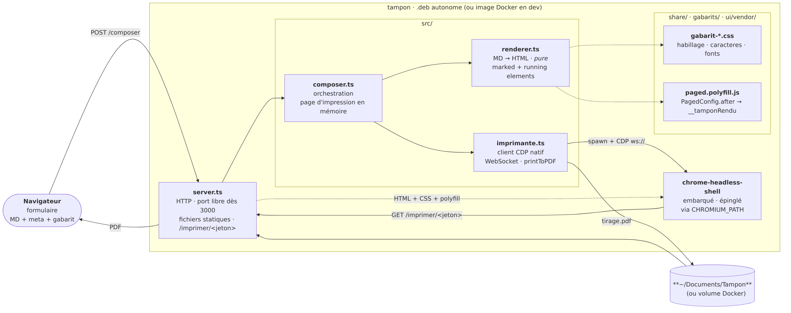

# sans-titre — atelier de composition

Générateur de PDFs typographiques à partir de Markdown. On colle du texte, on choisit un gabarit, on récupère un PDF prêt à imprimer.

## Installer (Linux)

```bash
sudo apt install ./tampon_0.3.0_amd64.deb
tampon
```

Le navigateur s'ouvre sur l'atelier. Les PDFs sont enregistrés dans `~/Documents/Tampon/`.

Le paquet est **autonome** : serveur compilé et moteur de rendu `chrome-headless-shell` embarqués, aucun navigateur ni runtime à installer. Validé sur Debian bookworm et Ubuntu 24.04 (voir [docs/suivi/expedition-deb.md](docs/suivi/expedition-deb.md)).

Pour construire le paquet : `make paquet` (→ `dist/`), puis `make test-deb` pour le valider dans des conteneurs vierges.

## Lancer en développement

```bash
docker compose up --build   # première fois
docker compose up           # ensuite
```

Ouvrir [http://localhost:3000/sans-titre.art/tampon](http://localhost:3000/sans-titre.art/tampon).

## Utilisation

1. Coller le contenu Markdown dans la zone de texte
2. Renseigner les métadonnées (titre, date, auteur) et choisir un gabarit
3. Cliquer **Composer →**
4. Le PDF s'ouvre dans le navigateur et est enregistré dans `~/Documents/Tampon/` (`tirages/` en Docker)

## Frontmatter

Les métadonnées peuvent aussi être déclarées directement dans le Markdown :

```markdown
---
gabarit: rapport
titre: Rapport d'activité — Saison 2025-2026
date: Avril 2026
auteur: Prénom Nom
---

Le contenu du document commence ici...
```

| Champ | Rôle |
|---|---|
| `gabarit` | `rapport`, `lettre` ou `ap` |
| `titre` | Affiché dans le bandeau haut et le nom du PDF |
| `date` | Affiché dans le bandeau haut |
| `auteur` | Affiché dans le pied de page |

## Gabarits

**Rapport** — document multi-pages avec bandeau haut (nom, titre courant, date), pied de page (coordonnées, numérotation), hiérarchie H1/H2/H3.

**Lettre** — format épistolaire : premier paragraphe aligné à droite (lieu et date), dernier paragraphe aligné à gauche (formule de politesse).

**Style AP** — grille modulaire (module 5 mm), échelle typographique de raison 1.25, fontes Jost / Inter / InterTight embarquées.

## Architecture



Le pipeline délègue autant que possible à [Paged.js](https://pagedjs.org/) :

- **`renderer.ts`** convertit le Markdown en HTML via `marked` et injecte les running elements (bandeau, pied de page)
- **CSS Paged Media** (`@page`, `position: running(...)`) gère la pagination et les éléments courants
- **`imprimante.ts`** pilote `chrome-headless-shell` en **Chrome DevTools Protocol** natif (WebSocket) : chargement de la page d'impression, attente de la fin de pagination Paged.js, `Page.printToPDF`

`composer.ts` orchestre : génère la page d'impression (servie en mémoire sur `/imprimer/<jeton>`), appelle `imprimante.ts`, retourne le nom du PDF produit. Ni puppeteer ni pagedjs-cli : le pipeline tient dans un binaire `bun build --compile`.

## Prérequis

- **Utilisateur** : aucun — `sudo apt install ./tampon_*.deb`.
- **Développement** : Docker. C'est tout.
