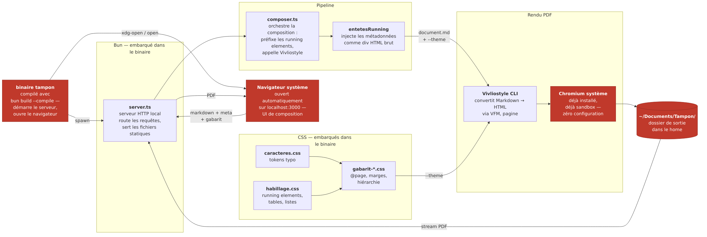

# Exploration — distribution standalone via Bun Launcher

## Idée

Un binaire unique compilé avec `bun build --compile`. Au lancement : le serveur HTTP démarre, le navigateur par défaut s'ouvre sur l'UI. L'utilisateur travaille dans son navigateur habituel — pas de fenêtre native, mais zéro friction à l'installation.

Modèle de référence : **Ollama** — un service local, une UI dans le browser, un binaire léger.

## Pourquoi après Electron

La branche Electron a buté sur le sandbox Chromium (AppImage incompatible setuid, user namespaces bloqués par AppArmor Ubuntu 24.04). La racine du problème : embarquer Chromium impose des contraintes de permissions non solubles proprement dans une AppImage.

L'insight clé : **Tampon n'a pas besoin d'une fenêtre native**. Ce qu'il produit c'est un PDF, pas une expérience UI riche. Le navigateur système suffit amplement pour l'interface de saisie.

## Ce qui change par rapport à v0.1

| v0.1 | Bun Launcher |
|---|---|
| Docker obligatoire au runtime | Binaire standalone |
| Lancement via `docker compose up` | Double-clic ou `./tampon` |
| Navigateur ouvert manuellement | Auto-ouvert au démarrage |
| Chromium bundlé (Electron) | Chromium **système** pour Vivliostyle |
| `tirages/` dans le container | `~/Documents/Tampon/` |
| 330Mo | ~97Mo (Bun runtime inclus) |

## Ce qui ne change pas

Le pipeline complet : `server.ts`, `composer.ts`, Vivliostyle CLI, CSS Paged Media. Le Chromium système est utilisé pour Vivliostyle — exactement comme dans Docker où on installait Chromium via apt.

## Prérequis système (utilisateur final)

- **Vivliostyle CLI** : `bun add -g @vivliostyle/cli` ou `npm install -g @vivliostyle/cli`
- **Chromium ou Chrome** : présent sur la majorité des machines

Le binaire détecte automatiquement vivliostyle dans `~/.bun/bin`, `~/.npm-global/bin`, `/usr/local/bin`. Si absent, un message clair indique la commande d'installation.

## Architecture cible



## Ce qui a été implémenté

### Chemins dynamiques
- `TAMPON_DIR` : base pour `gabarits/` et `ui/` — défaut `dirname(process.execPath)` (binaire compilé) ou `.` (dev)
- `TIRAGES_DIR` : défaut `~/Documents/Tampon/`
- `LOGS_DIR` : défaut `~/Documents/Tampon/logs/`
- `CHROMIUM_PATH` : chemin explicite vers chromium, facultatif (vivliostyle le détecte seul si absent)
- `VIVLIOSTYLE_BIN` : détecté au démarrage dans les emplacements courants, erreur claire si absent

### Build Docker
`Dockerfile.build` — multi-stage :
1. Stage `builder` (`oven/bun:1-debian`) : compile `server.ts` → binaire standalone
2. Stage `export` : assemble `bundle/` (binaire + `gabarits/` + `ui/`)

```bash
make build   # → dist/bundle/tampon + gabarits/ + ui/
```

### Comportement au lancement
- Détecte et occupe le premier port libre à partir de 3000
- Ouvre le navigateur via `xdg-open` / `open` / `start` selon la plateforme
- Si la commande d'ouverture est absente (env sans display), log l'URL et continue sans crasher

### Mode dev (Docker runtime)
`make dev` → `docker compose up` — pipeline complet testé, 7 secondes bout en bout, aucune régression visuelle.

## Points à creuser / prochaines étapes

- **Supprimer le prérequis vivliostyle** ← priorité v0.3
  Compiler vivliostyle en binaire standalone avec `bun build --compile` et le bundler dans le tarball et le `.deb`. Zéro prérequis utilisateur.
  Plan :
  1. `Dockerfile.build` : `bun add @vivliostyle/cli` + `bun build --compile node_modules/.bin/vivliostyle --outfile dist/vivliostyle`
  2. Inclure `dist/vivliostyle` dans les stages `export` et `deb` aux côtés du binaire `tampon`
  3. `src/composer.ts` : `VIVLIOSTYLE = join(dirname(process.execPath), "vivliostyle")` par défaut
  4. Supprimer le `postinst` vivliostyle et la section prérequis du README
  Inconnue à valider : taille du binaire vivliostyle compilé (potentiellement 100-200MB)

- **Cross-platform** : `--target bun-darwin-arm64`, `bun-darwin-x64`, `bun-windows-x64` depuis le même Docker
- **Tarball universel** : `tampon-linux-x64.tar.gz`, `tampon-darwin-arm64.tar.gz`, `tampon-windows-x64.zip`
- **Shutdown propre** : signal handler — pour l'instant le process reste en background
