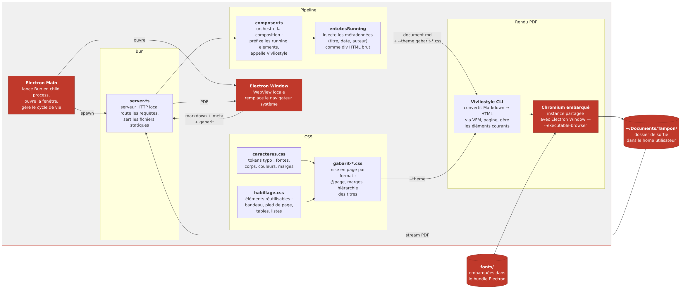

# Exploration — distribution desktop via Electron

## Idée

Transformer Tampon en application desktop distribuable : un exécutable, un double-clic, une fenêtre. Zéro Docker, zéro terminal, zéro friction pour l'utilisateur final.

## Philosophie

Le modèle est celui des **apps desktop bundlées** (Electron, Tauri) : le serveur local tourne en arrière-plan, l'UI s'ouvre dans une fenêtre native, l'utilisateur ne voit rien de l'infrastructure.

Electron est l'option la plus cohérente ici pour une raison précise : **Chromium est déjà la dépendance fatale de Vivliostyle**. Electron embarque Chromium — on peut pointer Vivliostyle vers cette instance plutôt que d'en installer une séparée. Une seule copie de Chromium pour les deux usages.

## Ce qui change par rapport à v0.1

| v0.1 | Electron |
|---|---|
| Docker obligatoire | Binaire natif par OS |
| Navigateur système | Fenêtre Electron (WebView) |
| Chromium headless séparé | Chromium embarqué d'Electron (partagé) |
| Lancement via `docker compose up` | Double-clic |

## Ce qui ne change pas

Le pipeline intérieur reste identique : `server.ts`, `composer.ts`, Vivliostyle CLI, CSS Paged Media, `tirages/`. Electron est un wrapper autour de ce qui existe déjà.

## Architecture cible

## Ce qui a été implémenté

- `electron/main.js` — spawne Bun en child process, gère le cycle de vie, attend que le serveur réponde avant d'ouvrir la fenêtre
- `Dockerfile.build` — build isolé via Docker : Electron, Bun sidecar, Vivliostyle, Playwright Chromium bundlé
- `electron/afterPack.js` — retire `chrome-sandbox` de l'AppImage (incompatible setuid)
- `electron/assets/icon.png` — icône 512×512
- Variables d'env (`GABARITS_DIR`, `TIRAGES_DIR`, `LOGS_DIR`, `BUN_BIN`, `VIVLIOSTYLE_BIN`, `CHROMIUM_PATH`) — découplage complet des chemins Docker/Electron
- Format `.deb` préparé avec `after-install.sh` pour `chown root / chmod 4755` sur `chrome-sandbox`

## Ce qui fonctionne

- Build AppImage et .deb via `docker build -f Dockerfile.build` ✓
- Serveur Bun spawné en child process ✓
- UI accessible et fenêtre Electron qui s'ouvre ✓ (testé)
- Génération PDF fonctionnelle depuis l'AppImage ✓

## Mur architectural rencontré — sandbox Chromium sur Ubuntu 24.04

Trois couches de problème imbriquées :

1. **AppImage + setuid** : `chrome-sandbox` doit être `chown root / chmod 4755` — impossible dans une AppImage montée en read-only.
2. **User namespaces (fallback)** : bloqué par Ubuntu 24.04 via `kernel.apparmor_restrict_unprivileged_userns=1`, restriction AppArmor introduite en 23.10.
3. **Fix `.deb`** : un paquet `.deb` peut exécuter un post-install qui règle les permissions — c'est ce que font VS Code, Slack, Discord. Implémenté mais non testé.

**Fix supplémentaire identifié** : lancer Vivliostyle via `BUN_BIN` et non le Node système (shebang `#!/usr/bin/env node` invoque parfois un Node trop ancien qui ne gère pas l'ESM). Implémenté dans `composer.ts`.

## Décision — branche suspendue, non abandonnée

Le `.deb` est la solution correcte pour Electron sur Ubuntu et reste à tester. Mais le rapport complexité/bénéfice de toute l'approche Electron est défavorable pour Tampon :

- 330Mo de bundle pour une UI qui reste dans un onglet
- Sandbox Chromium : problème récurrent à chaque évolution kernel/AppArmor
- La valeur d'Electron (fenêtre native) est secondaire pour cet outil

**On repart sur `explore/bun-launcher`** : service Bun standalone + navigateur système + Chromium système pour Vivliostyle. Fraction de la complexité, portabilité maximale. Les apprentissages de cette branche (env vars, paths, Vivliostyle via Bun, Dockerfile.build) sont directement réutilisables.
