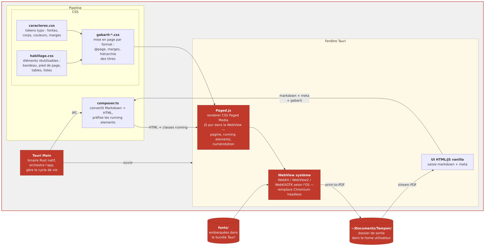

# Exploration — distribution desktop via Paged.js + Tauri

## Idée

Remplacer Vivliostyle (qui impose Chromium) par **Paged.js**, un renderer CSS Paged Media en JS pur qui tourne dans n'importe quelle WebView. Associé à **Tauri**, on obtient un binaire natif léger sans Chromium embarqué.

## Pourquoi c'est l'état de l'art

| Electron + Vivliostyle | Paged.js + Tauri |
|---|---|
| Chromium embarqué (~150Mo) | WebView système (0Mo) |
| Bundle > 200Mo | Bundle < 10Mo |
| Dépendance Chromium headless | JS pur, aucune dépendance native |
| 2015 | Actif, porté par le W3C/CSS WG |

Paged.js implémente les specs CSS Paged Media (W3C) directement dans le navigateur — exactement les mêmes `@page`, `position: running(...)`, `counter(page)` qu'on utilise déjà. **Nos CSS ne changent pas.**

## Ce qui change par rapport à v0.1

| v0.1 | Paged.js + Tauri |
|---|---|
| Docker obligatoire | Binaire natif par OS |
| Vivliostyle CLI (Node) | Paged.js (JS dans la WebView) |
| Chromium headless | WebView système (Safari/WebKit sur Mac, WebView2 sur Windows, WebKitGTK sur Linux) |
| `bun server.ts` indépendant | Tauri Main (Rust) orchestre tout |
| Navigateur système | Fenêtre Tauri native |
| `tirages/` Docker | `~/Documents/Tampon/` |

## Ce qui ne change pas

Les CSS Paged Media (`gabarit-*.css`, `habillage.css`, `caracteres.css`) sont réutilisés tels quels — Paged.js implémente les mêmes specs. `composer.ts` est simplifié : plus d'appel CLI externe, Paged.js tourne dans la WebView directement.

## Architecture cible

## Pipeline de rendu

1. L'utilisateur colle son Markdown dans la fenêtre Tauri
2. Tauri Main (Rust) passe le contenu à un renderer JS embarqué (ou Bun via IPC)
3. Le Markdown est converti en HTML (VFM ou marked, léger)
4. Paged.js pagine le HTML dans la WebView en appliquant les CSS
5. `window.print()` ou l'API Tauri déclenche l'impression PDF via la WebView système
6. Le PDF est écrit dans `~/Documents/Tampon/`

## Points à creuser

- **Print-to-PDF via WebView** : Tauri expose `tauri::webview::print()` — à valider que la sortie PDF est fidèle (qualité typo, marges, éléments courants).
- **Paged.js en mode headless** : Paged.js peut aussi tourner via Puppeteer/Playwright pour un rendu hors-écran si la WebView système ne suffit pas.
- **Conversion Markdown** : sans Vivliostyle/VFM, on rebrancher un parser léger (marked, micromark) juste pour le corps — ou on garde VFM comme lib Node appelée par Tauri via sidecar.
- **Fonts** : embarquer Atkinson Hyperlegible dans le bundle Tauri.
- **CSS running elements** : Paged.js les supporte nativement — à tester avec nos gabarits actuels sans modification.
